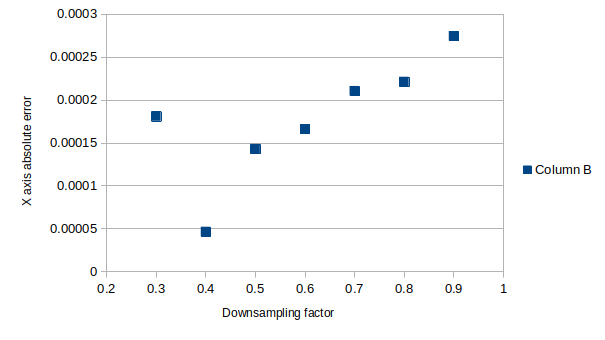
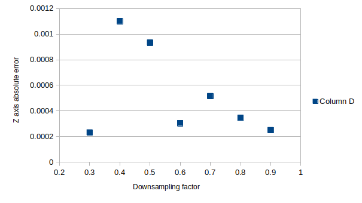

# small_gicp

**small_gicp** is a header-only C++ library providing efficient and parallelized algorithms for fine point cloud registration (ICP, Point-to-Plane ICP, GICP, VGICP, etc.). It is a refined and optimized version of its predecessor, [fast_gicp](https://github.com/SMRT-AIST/fast_gicp), re-written from scratch with the following features.

This repository is mostly unchanged from the original, except for a small experiment I started to see to what extent downsampling would affect the accuracy of ICP. My approach was just to take one file, translate it by a certain amount, and see if this implementation of ICP could measure the same translation that I applied to the file. There's a quick script in this folder called translatePLY.py that I used to take the source.ply file in the data folder and create a translated version of the same file. One thing I have yet to figure out is how to translate these numbers into real world measurements (e.g. I translated the ply file by "5" on every axis, but I have no clue if that corresponds to 5 meters or 5 centimeters). I think I would need calibration data from the sensor that produced these pointclouds. In any case, I was able to reproduce the translation for the most part, but there were small amounts of error relative to the amount that was translated by. The relationship between downsampling factor and error only seemed intuitive on the z axis, where larger downsampling factors did seem to correlate with less error. Otherwise, I do not see a convincing correlation between using more points in ICP and achieving less measurement error. 

 
